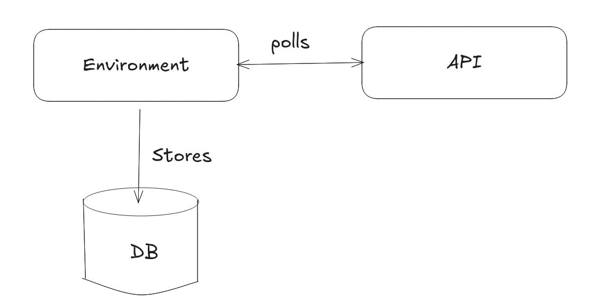

### Requirement

The script will poll the API every 10 seconds, save the response to response.txt, and insert it into an SQLite database data.db



Steps:

1. Install node-fetch
2. Install sqlite3
3. Run pollAndStore.js

```sh
npm install node-fetch sqlite3
node pollAndStore.js
```

Update:

We don't need node-fetch now, it was used before node.js < 18. For newer version it is inbuilt and don't need to use it, if we use that we get the error of not being a function.

```sh
npm install sqlite3
node pollAndStore.js
```
